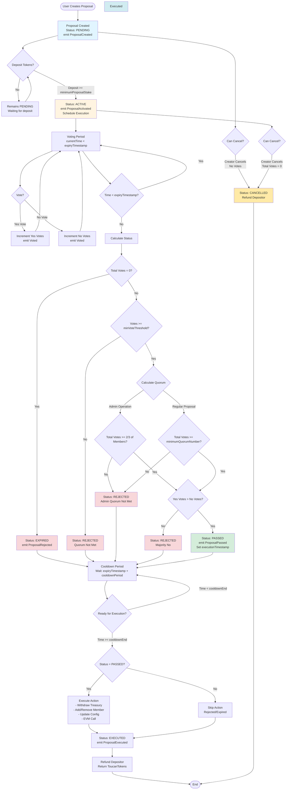
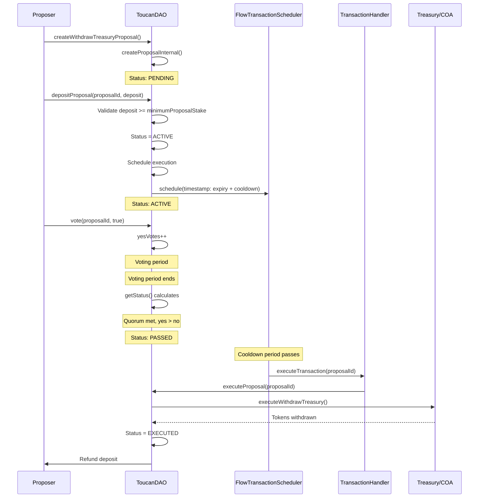
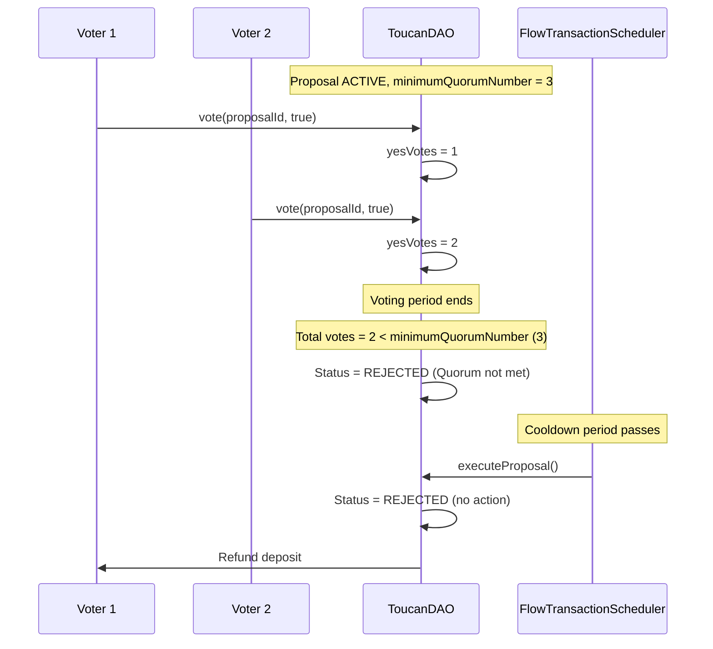
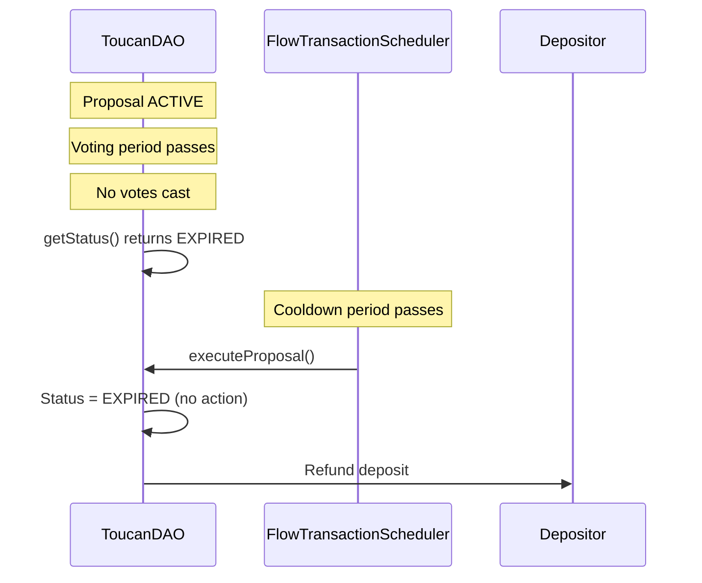
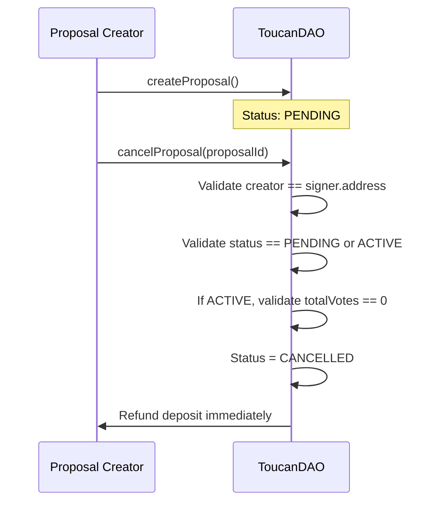
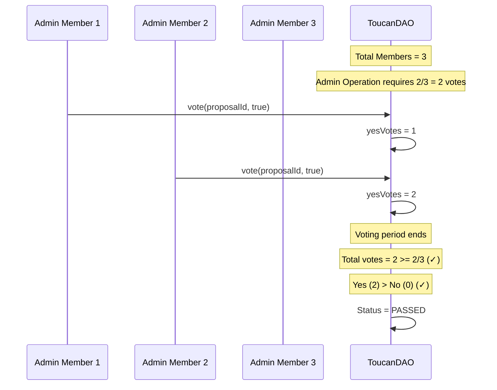
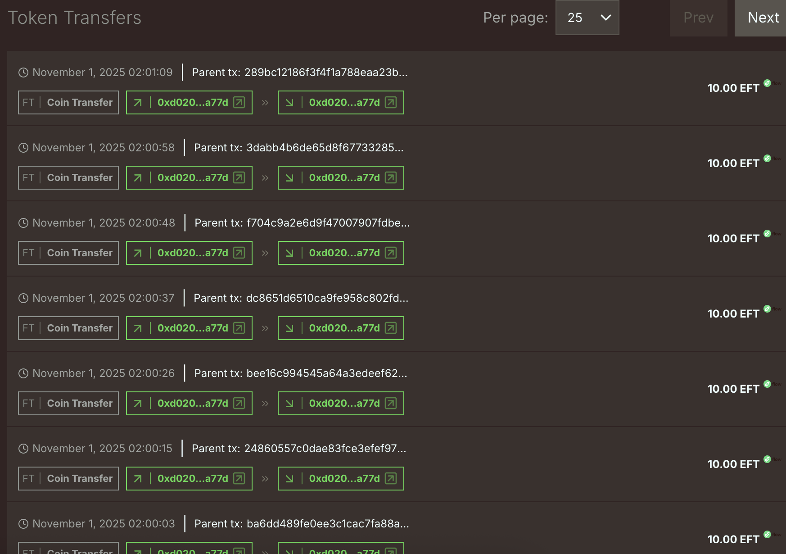
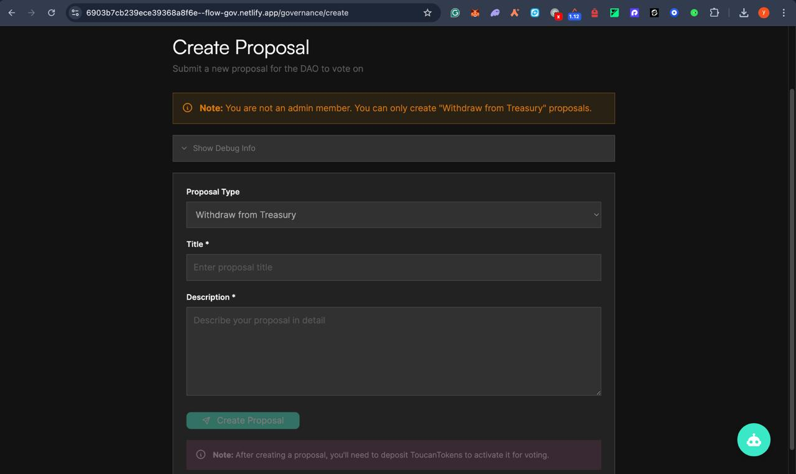

# FlowGov

## Overview

FlowGov is a **governance-focused fork** of the [Toucans DAO project](https://github.com/emerald-dao/project-toucans-v2) with significant architectural improvements, modern Cadence 1.0 implementation, and enhanced features for Flow blockchain governance. 

This project **simplifies and modernizes** the original Toucans DAO by:
- **32% code reduction** (548 lines removed) for better maintainability
- **Modern architecture** with native Cadence 1.0 + Flow 2.0 features
- **EVM integration** via Cadence-Owned Accounts (COA) for multi-chain governance
- **AI-powered governance assistance** for proposal understanding and voting guidance
- **Automated workflow capabilities** using Flow's Transaction Scheduler

**🌐 Live Demo**: [Netlify Deployment](https://flow-gov.netlify.app/)

---

## 📹 Video Demo & Project Showcase

### 🎥 Demo Video

**Full Project Walkthrough** - See ToucanDAO in action!

<video width="800" controls style="border-radius: 8px; margin: 20px 0;">
  <source src="docs/screenshots/telegram-cloud-document-4-5773814945074389219.mp4" type="video/mp4">
  Your browser does not support the video tag.
</video>


### 🔗 Quick Links to Verify Our Work

- **📹 Demo Video**: Watch the full walkthrough above
- **🌐 Live Deployment**: 
  - [Flowscan Testnet - ToucanDAO](https://testnet.flowscan.io/account/0xd020ccc9daaea77d)
  - [Flowscan - ToucanToken](https://testnet.flowscan.io/account/0xd020ccc9daaea77d)
- **🌐 EVM Contract**: 
  - [EVM Explorer - FlowTreasuryWithOwner](https://testnet.evm.nodes.onflow.org/)
- **📊 Architecture Diagrams**: See the detailed proposal lifecycle flow diagram below

**📊 Quick Stats**:
- ✅ **11 new smart contract features** (Proposal System, EVM Integration, Scheduler, etc.)
- ✅ **AI Governance Agent** (Frontend innovation)
- 🔄 **9 features** significantly modified (Voting, Architecture, State Management, etc.)
- ❌ **11 features** removed (most can be executed via EVM calls!)
- 🎯 **Core concepts** retained (Treasury, Multi-Actor Decisions, Action Execution)

**🏆 Hackathon Achievements**:
- ✅ **32% code reduction** while adding new features
- ✅ **Trustless Automation** - all proposals auto-execute (most DAOs lack this!)
- ✅ **EVM Integration** - enables arbitrary logic execution
- ✅ **Full Automation** - auto-execute + auto-refund, zero maintenance
- ✅ **Community-Driven** - anyone can support proposals
- ✅ **AI-Powered** - conversational governance assistance
- ✅ **Comprehensive E2E Testing** - extensive test suite covering all scenarios
- ✅ **Deployed & Tested** - Live on Flow Testnet with 50+ proposals created and voted on

**🎯 Key Differentiators:**
1. **Trustless Automated Execution** - No manual execution needed (unlike most DAOs)
2. **EVM Arbitrary Calls** - Execute any logic via EVM (extensible architecture)
3. **Full Automation** - Auto-execute + auto-refund (zero maintenance)
4. **Community Support** - Anyone can activate proposals (not just creator)
5. **Comprehensive E2E Testing** - Extensive test coverage ensures reliability

**🏆 Built for Forte Hacks by Flow: Build with Disney, Dune and Dapper**

This project was developed as part of [Forte Hacks](https://www.hackquest.io/hackathons/Forte-Hacks?utm=MENA), Flow's 2025 flagship hackathon running from October 1-31st. The hackathon invites hackers, creators, and Web3 developers to push the boundaries of smart contract automation, DeFi primitives, and user-centric applications to win a share of $250,000 in bounties and prizes. Supported by partners including Dune, Quicknode, Moonpay, Dapper Labs, Thirdweb, Privy, Crossmint, and more.

---

## 🎯 Hackathon Project Highlights 

### 🚀 Core Innovation #1: Trustless Automated Execution via Flow Transaction Scheduler

**The Revolution**: **Most DAOs require manual execution** - someone must call `executeProposal()` after voting ends. **We've eliminated this completely** - all proposals auto-execute via Flow's Transaction Scheduler!

**Why This Is Revolutionary:**

| Traditional DAOs | ToucanDAO (Our Solution) |
|------------------|--------------------------|
| ❌ **Manual Execution Required** | ✅ **Fully Automated Execution** |
| ❌ Someone must call `executeProposal()` | ✅ Scheduled automatically on deposit |
| ❌ Relies on trusted executor | ✅ **Trustless** - Flow network executes |
| ❌ Execution can be delayed/blocked | ✅ Executes precisely at scheduled time |
| ❌ Single point of failure | ✅ Distributed, network-level execution |
| ❌ Requires monitoring and manual work | ✅ **Zero maintenance** - fully automated |

**How It Works:**
```
1. Proposal Created (Pending)
2. Anyone Deposits → Status: Active → Automatically Scheduled for Execution
3. Voting Period (Community votes)
4. Voting Ends → Status Calculated (Passed/Rejected/Expired)
5. Cooldown Period (Safety mechanism)
6. 🚀 AUTOMATIC EXECUTION via Flow Transaction Scheduler (No human needed!)
7. Deposits Auto-Refunded
```

**Key Benefits:**
- ✅ **Trustless**: No reliance on specific individuals or multisig executors
- ✅ **Automated**: Execution happens automatically after cooldown
- ✅ **Precise Timing**: Executes at exact scheduled timestamp
- ✅ **No Single Point of Failure**: Flow network handles execution
- ✅ **Gas Optimization**: Fees estimated and paid automatically
- ✅ **Unstoppable**: Cannot be blocked or delayed by centralized parties

**Competitive Advantage:**
> **Most DAOs lack this critical feature!** They require manual execution which creates:
> - Execution delays
> - Trust requirements
> - Single points of failure
> - Maintenance overhead
>
> **ToucanDAO is fully automated and trustless** - execution happens automatically without any human intervention!

### 💎 Core Innovation #2: EVM Integration Enables Arbitrary Logic Execution

**The Game-Changer**: While we simplified the Cadence contract by removing complex features (NFTs, token locking, batch operations, etc.), **we can still execute them via EVM calls**!

**Why This Matters:**
- ✅ **Best of Both Worlds**: Simple, auditable Cadence contract + flexible EVM execution
- ✅ **No Contract Upgrades Needed**: Deploy new EVM contracts, propose calls via governance
- ✅ **Extensible Architecture**: Add functionality without modifying core Cadence contract
- ✅ **Bridge to Removed Features**: Execute removed features (NFTs, batch ops, etc.) via EVM
- ✅ **Execute Arbitrary Data**: Any EVM contract call can be executed through governance

**Example Workflow**: 
```
User wants NFT support → Deploy EVM NFT contract → Create EVMCall proposal → 
Community votes → Passes → Auto-executes after cooldown → NFT operation performed via EVM
All deposits automatically refunded!
```

### 📋 Feature Summary by Category

#### 🔧 Smart Contract Features

| # | Feature | Description | Innovation |
|---|---------|-------------|------------|
| 1 | **🔄 Trustless Auto-Execution** | **All proposals auto-execute** via Flow Transaction Scheduler (most DAOs lack this!) | Trustless, no manual intervention, unstoppable |
| 2 | **💰 Auto-Refunds** | **All deposits automatically refunded** for all outcomes (Passed/Rejected/Expired) | Depositor never loses funds |
| 3 | **👥 Community Support** | **Anyone can deposit** to activate proposals (not just creator) | Community empowers each other |
| 4 | **⏰ Auto-Expiry** | **Proposals expire automatically** if not supported/voted on | Clean system, no stale proposals |
| 5 | **🔗 EVM Arbitrary Calls** | **Execute arbitrary EVM contract calls** - bridge to removed features | Extensible without upgrades |
| 6 | **🎯 Token-Weighted Voting** | Any token holder votes (economic stake required) | More democratic governance |
| 7 | **📊 Dynamic Status** | Status calculated automatically (no manual updates) | Error-resistant transitions |
| 8 | **🛡️ Safe Refund System** | Proper depositor tracking with capability validation | Fixed critical fund loss bug |
| 9 | **⏱️ Cooldown Periods** | Time delay before execution (safety mechanism) | Prevents rash decisions |
| 10 | **📈 Differentiated Quorum** | Admin ops: 2/3 members, Regular: configurable | Flexible governance rules |
| 11 | **🔐 Modern Cadence 1.0** | Native Cadence 1.0 + Flow 2.0 features | Future-proof, no migration |

#### 🎨 Frontend Features

| # | Feature | Description | Innovation |
|---|---------|-------------|------------|
| 1 | **🤖 AI Governance Agent** | **Conversational interface** for proposal understanding | Democratizes governance access |
| 2 | **💬 Natural Language Queries** | Ask questions about proposals in plain English | No technical knowledge required |
| 3 | **📊 Proposal Dashboard** | Real-time proposal status and voting information | Enhanced user experience |
| 4 | **🔒 Secure Architecture** | API keys kept server-side only | Production-ready security |
| 5 | **⚡ Real-Time Updates** | Live proposal data and status tracking | Responsive user interface |

#### 🧪 Testing & Quality Assurance

| # | Feature | Description | Innovation |
|---|---------|-------------|------------|
| 1 | **🔬 E2E Test Suite** | **11 comprehensive E2E test scripts** covering all scenarios | Production-ready reliability |
| 2 | **✅ EVM Integration E2E** | Complete EVM call proposal flow tested end-to-end | Verifies cross-chain functionality |
| 3 | **🛡️ Foundry Tests** | Solidity contract test suite (100% pass rate) | Smart contract reliability |
| 4 | **📊 Multi-Scenario Testing** | Edge cases, cancellation, expiry, multi-account tested | Comprehensive coverage |
| 5 | **✅ Real-World Verification** | 50+ proposals tested on Flow Testnet | Battle-tested in production |

### 🔧 Smart Contract Achievements

| Feature | Innovation | Impact |
|---------|-----------|--------|
| **🔄 Full Automation** | **All proposals auto-execute** after cooldown via Transaction Scheduler | No manual intervention, prevents execution delays |
| **💰 Auto-Refunds** | **All deposits automatically refunded** for all outcomes | Depositor never loses funds, even if proposal fails |
| **👥 Community Support** | **Anyone can deposit** to activate proposals (not just creator) | Community empowers each other's proposals |
| **⏰ Auto-Expiry** | **Proposals expire automatically** if not supported/voted | Clean system, no stale proposals |
| **🔗 EVM Bridge** | **Execute arbitrary EVM calls** - bridge to removed features | Extensible without contract upgrades |
| **🎯 Token-Weighted Voting** | Any token holder votes (economic stake required) | More democratic than fixed signers |
| **📊 Dynamic Status** | Status calculated automatically (no manual updates) | Error-resistant, automatic transitions |

### 🎨 Frontend Achievements

| Feature | Innovation | Impact |
|---------|-----------|--------|
| **🤖 AI Governance Agent** | **Conversational interface** for proposal understanding | Democratizes access, makes governance accessible |
| **💬 Natural Language Queries** | Ask questions in plain English | No technical knowledge required |
| **📈 Real-Time Dashboard** | Live proposal status and voting info | Enhanced user experience |
| **🔒 Secure Architecture** | API keys server-side only | Production-ready security |

### 🏗️ Technical Excellence

- ✅ **32% Code Reduction**: Simplified while adding features
- ✅ **Modern Cadence 1.0**: Built from scratch, no migration needed
- ✅ **Flow 2.0 Features**: Transaction Scheduler integration
- ✅ **EVM Integration**: Cadence-Owned Account (COA) for multi-chain operations
- ✅ **Deployed & Tested**: Live on Flow Testnet with 50+ proposals

### 📈 Real-World Deployment Stats

- ✅ **28 active proposals** currently on testnet
- ✅ **50+ proposals** created and tested
- ✅ **Multiple proposal types** tested (WithdrawTreasury, EVMCall)
- ✅ **Voting system** verified with random yes/no votes
- ✅ **Auto-execution** working via Transaction Scheduler
- ✅ **EVM calls** successfully executed through COA

### 🧪 Comprehensive Testing Suite

**We have extensive E2E (End-to-End) and integration testing** to ensure reliability and correctness!

#### E2E Testing Scripts

| Test Script | Coverage | Description |
|------------|----------|-------------|
| **`13_evm_call_proposal_e2e.sh`** | ⭐ **EVM Integration E2E** | Complete flow: Create EVM call proposal → Vote → Auto-execute → Verify EVM call success |
| **`10_comprehensive_test.sh`** | ⭐ **Full System Test** | Comprehensive test covering all proposal types, voting scenarios, and edge cases |
| **`01_basic_proposal_workflow.sh`** | Basic Workflow | Create → Deposit → Vote → Execute flow |
| **`02_multi_voter_scenario.sh`** | Multi-Voter | Multiple voters voting on same proposal |
| **`03_admin_operations.sh`** | Admin Ops | Add/remove members, update config proposals |
| **`04_proposal_cancellation.sh`** | Cancellation | Proposal cancellation and refund flow |
| **`05_multiple_proposals.sh`** | Multi-Proposal | Handling multiple concurrent proposals |
| **`06_complete_lifecycle.sh`** | Lifecycle | Full proposal lifecycle: Pending → Active → Passed/Rejected → Executed |
| **`07_voting_scenarios.sh`** | Voting | Various voting scenarios (yes/no, quorum, expiry) |
| **`08_dao_state_queries.sh`** | State Queries | Testing DAO state queries and configuration |
| **`09_proposer_depositor_voter_scenarios.sh`** | Roles | Different roles (proposer, depositor, voter) scenarios |
| **`11_realistic_multi_account.sh`** | Multi-Account | Realistic multi-account deployment and interaction |

#### Foundry Tests (Solidity)

| Test File | Coverage | Description |
|-----------|----------|-------------|
| **`FlowTreasuryWithOwner.t.sol`** | ⭐ **Treasury E2E** | Complete FlowTreasury contract tests: deployment, ownership, execution, COA integration |
| **`FlowTreasury.t.sol`** | Base Treasury | Base treasury contract functionality |
| **`Counter.t.sol`** | Integration | Example counter contract for testing EVM calls |

#### Test Coverage Highlights

**✅ E2E Test Coverage:**
- ✅ **Proposal Creation** - All proposal types (WithdrawTreasury, EVMCall, AdminOps)
- ✅ **Deposit & Activation** - Anyone can deposit, activation flow
- ✅ **Voting System** - Token-weighted voting, quorum enforcement, majority rules
- ✅ **Auto-Execution** - Transaction Scheduler integration, cooldown periods
- ✅ **Auto-Refunds** - Refund verification for all outcomes
- ✅ **EVM Integration** - Complete EVM call proposal E2E (create → vote → execute → verify)
- ✅ **Proposal Lifecycle** - All status transitions (Pending → Active → Passed/Rejected/Expired → Executed)
- ✅ **Edge Cases** - Cancellation, expiry, insufficient funds, invalid votes
- ✅ **Multi-Account** - Realistic scenarios with multiple accounts
- ✅ **Admin Operations** - Member management, configuration updates

**✅ Smart Contract Tests:**
- ✅ **FlowTreasuryWithOwner** - Full test suite for EVM treasury contract
- ✅ **COA Ownership** - Verifies COA owns treasury correctly
- ✅ **EVM Execution** - Contract call execution verification
- ✅ **Access Control** - Owner-only functions tested

**✅ Integration Tests:**
- ✅ **Cadence ↔ EVM** - Full integration between Cadence DAO and EVM contracts
- ✅ **Transaction Scheduler** - Automated execution testing
- ✅ **Multi-Token** - Treasury supports multiple token types

**Test Results:**
- ✅ **All E2E tests passing** on Flow Testnet
- ✅ **Foundry tests**: 100% pass rate
- ✅ **50+ proposals** tested end-to-end
- ✅ **Multiple proposal types** verified
- ✅ **Auto-execution** verified via Transaction Scheduler
- ✅ **EVM calls** successfully tested and verified

**Why This Matters:**
- 🛡️ **Reliability**: Comprehensive testing ensures the DAO works correctly
- 🔒 **Security**: Edge cases and failure modes tested
- ✅ **Production-Ready**: Extensive E2E testing validates real-world scenarios
- 📊 **Confidence**: All features tested before deployment

---

## 🚀 Key Technical Features

### 🌟 Smart Contract Innovations

#### 1. **EVM Integration & Arbitrary Logic Execution** ⭐ **Hackathon Highlight**

ToucanDAO features **unprecedented flexibility** through EVM integration via Cadence-Owned Accounts (COA). This enables executing **arbitrary EVM contract calls**, allowing the DAO to perform any logic not natively supported by Cadence structures.

**Key Capabilities:**
- ✅ **Execute Arbitrary Data**: Call any EVM contract with custom function signatures and parameters
- ✅ **Bridge Removed Features**: Functions removed from the original (NFT operations, token locking, batch operations, etc.) can be executed via EVM calls
- ✅ **Multi-Chain Governance**: Execute operations on Flow EVM network through DAO proposals
- ✅ **Extensible Architecture**: Add new functionality without contract upgrades by deploying EVM contracts

**Example Use Cases:**
```solidity
// Execute removed features via EVM calls:
- NFT transfers (removed from Cadence)
- Batch token operations (removed from Cadence)
- Complex DeFi operations
- Cross-chain interactions
- Custom treasury logic
```

**Deployment:**
- **COA Address**: `0x000000000000000000000002120f118C7b3e41E4` (Funded with 2M FLOW)
- **FlowTreasuryWithOwner**: `0xAFC6F7d3C725b22C49C4CFE9fDBA220C2768998F` (Flow EVM Testnet)
- **Chain ID**: 545 (Flow Testnet EVM)

#### 2. **Trustless Automated Execution** ⭐ **Revolutionary Feature**

**All proposals auto-execute** via Flow's Transaction Scheduler - **this is what most DAOs lack!**

**The Problem with Traditional DAOs:**
- Most DAOs require manual execution after voting ends
- Someone must monitor proposals and call `executeProposal()`
- Creates single points of failure and trust requirements
- Execution can be delayed or blocked
- Requires ongoing maintenance and monitoring

**Our Solution:**
- ✅ **Automatic Scheduling**: Proposals scheduled when deposited (no manual step)
- ✅ **Trustless Execution**: Flow network executes automatically - no trusted party needed
- ✅ **Cooldown Enforcement**: Built-in safety period before execution (prevents rash decisions)
- ✅ **Fee Automation**: FlowToken fees automatically estimated and paid
- ✅ **Handler Pattern**: Dedicated transaction handler executes proposals
- ✅ **Status-Based Execution**: Passed proposals execute actions, rejected/expired skip execution
- ✅ **Precise Timing**: Executes at exact scheduled timestamp (after cooldown)
- ✅ **Zero Maintenance**: No monitoring, no manual intervention, fully automated

**Why This Matters:**
```
Traditional DAO Flow:
Proposal → Vote → Wait... → Someone monitors → Manually calls execute() → Execution

ToucanDAO Flow:
Proposal → Vote → Automatically scheduled → Auto-executes → Done!
```

**Impact**: This makes ToucanDAO **trustless and fully automated** - a major competitive advantage over most existing DAOs!

#### 3. **Automatic Deposit Refunds** ⭐

**Deposits are automatically refunded** after proposal resolution - depositor never loses funds!

- ✅ **Safe Refund System**: Proper depositor tracking prevents fund loss
- ✅ **All Outcomes Refunded**: Refunded for Passed, Rejected, Expired, and Cancelled proposals
- ✅ **Capability Validation**: Checks receiver capability before refunding (prevents silent failures)
- ✅ **Immediate Refund**: Cancelled proposals refund immediately

#### 4. **Community-Driven Proposals** ⭐

**Anyone can support proposals** - making it easier for the community to propose and support each other!

- ✅ **Open Proposal Creation**: Any account can create proposals
- ✅ **Open Deposit Support**: Anyone (not just creator) can deposit to activate proposals
- ✅ **Community Empowerment**: Community members can support proposals they believe in
- ✅ **Anti-Spam Protection**: Minimum stake requirement prevents proposal flooding

#### 5. **Time-Based Proposal Management** ⭐

**Proposals automatically expire** if not supported or voted on!

- ✅ **Voting Period Expiry**: Proposals expire after voting period ends with no votes
- ✅ **Automatic Cleanup**: Expired proposals are automatically cleaned up
- ✅ **Status Tracking**: Dynamic status calculation based on time and votes
- ✅ **No Stale Proposals**: Old proposals don't clutter the system

#### 1. **Proposal-Based Governance System**
- Complete lifecycle management with 7 status states
- Two-stage activation: Create → Deposit to activate (anyone can deposit)
- Dynamic status calculation based on votes, time, and quorum
- Proposal expiry and cancellation support
- **Auto-execution** after cooldown via Transaction Scheduler

#### 2. **Token-Weighted Voting System**
- Any ToucanToken holder can vote (not just designated signers)
- Economic stake requirement ensures voters have skin in the game
- Majority-based decisions (yes votes > no votes)
- Differentiated quorum rules (Admin: 2/3 members, Regular: configurable)
- Detailed vote tracking with vote history

#### 3. **Flow Transaction Scheduler Integration** ⭐ **Competitive Advantage**

**This is what sets us apart from most DAOs!**

- ✅ **Automated Execution**: No manual `executeProposal()` call needed - **trustless automation**
- ✅ **Time-Based Triggers**: Executes at precise timestamp via Flow 2.0's Transaction Scheduler
- ✅ **Built-in Fee Handling**: FlowToken fees automatically estimated and paid
- ✅ **Priority-Based Execution**: High/Medium/Low priority levels for cost optimization
- ✅ **Network-Level Execution**: Flow network handles execution - no single point of failure
- ✅ **Unstoppable**: Cannot be blocked, delayed, or censored - executes automatically

**Comparison to Other DAOs:**
```
❌ Compound/Aave/Uniswap Governance:
   Proposal → Vote → Manual execution required → Someone must call execute()

✅ ToucanDAO:
   Proposal → Vote → Automatically scheduled → Auto-executes (trustless!)
```

**Technical Implementation:**
- Uses `FlowTransactionScheduler.schedule()` to queue execution
- Handler resource implements `TransactionHandler` interface
- Execution happens at: `expiryTimestamp + cooldownPeriod + 1.0`
- Status checked automatically, only Passed proposals execute actions
- All deposits refunded automatically regardless of outcome

#### 4. **Safe Deposit & Refund System**
- Proposal deposits required to activate (anti-spam)
- **Automatic refunds** after proposal resolution
- Proper depositor tracking prevents fund loss bugs
- Capability validation ensures safe refunds
- Refunded for all outcomes: Passed, Rejected, Expired, Cancelled

#### 5. **Modern Cadence 1.0 Architecture**
- Native Cadence 1.0 syntax (no migration needed)
- Modern entitlements and access control
- Flow 2.0 features integrated from the start
- Future-proof design patterns
- Clean, auditable codebase (32% smaller than original)

#### 6. **EVM Integration via COA** ⭐ **Innovation Highlight**

**Revolutionary Feature**: Execute arbitrary EVM contract calls through governance proposals!

This enables the DAO to:
- Execute logic not supported by Cadence structs
- Bridge removed features via EVM contracts (NFT operations, batch operations, etc.)
- Extend functionality without contract upgrades
- Perform multi-chain operations atomically

**How It Works:**
```
Proposal Created → Community Votes → Passed → Auto-Execute via COA
                                                   ↓
                                    EVM Contract Call (arbitrary logic)
                                                   ↓
                                    Flow EVM Network Execution
```

### 🎨 Frontend Features

#### 1. **AI Governance Agent** ⭐ **Hackathon Highlight**

An intelligent, conversational interface that democratizes access to DAO governance.

**Key Capabilities:**
- 🤖 **Natural Language Queries**: Ask questions about proposals in plain English
- 📊 **Proposal Analysis**: Understand proposal content, voting history, and status
- 💡 **Voting Guidance**: Get recommendations and explanations for complex proposals
- 🔍 **Context-Aware Responses**: Answers based on current DAO state and proposals
- 🔒 **Secure Implementation**: API keys kept server-side, never exposed to client
- ⚡ **Real-Time Updates**: Live proposal data and status tracking

**Acceptance Criteria:**
- ✅ Fetch all Flow governance proposals on the frontend
- ✅ Simple chat UI component for the Gov Agent
- ✅ AI model integration for answering proposal-related questions
- ✅ Answer basic questions (title, description, status, voting info)
- ✅ Loading state display while agent responds
- ✅ Error message handling for failed requests
- ✅ No API keys exposed on frontend

**Use Cases:**
- "What is proposal #5 about?"
- "Should I vote yes on the treasury withdrawal?"
- "Who has voted on this proposal?"
- "What's the current treasury balance?"

#### 2. **User Interface**
- Modern, responsive design
- Proposal listing and filtering
- Voting interface with clear yes/no options
- Treasury balance displays
- Member management interface (for admin operations)

#### 3. **Real-Time Updates**
- Live proposal status updates
- Vote count tracking
- Treasury balance monitoring
- Event notifications

### 🌉 Forte Integration (Onchain) - Future Enhancement

Leverages Flow's Forte network upgrade to enable composability and automation for governance operations.

**Planned Forte Features:**
- **Actions**: Standardized, reusable building blocks for governance operations
- **Workflows**: Composable sequences that automate governance processes
- **Time-based triggers**: Schedule governance actions and automated voting

**Reference**: [Forte: Introducing Actions & Agents](https://www.flow.com/post/forte-introducing-actions-agents-supercharging-composability-and-automation)

**Status**: ⏳ Planned for future implementation (post-hackathon)

## Project Structure

```
flow-gove/
├── frontend/                       # SvelteKit frontend with AI agent
├── backend/
│   └── modified_toucan/            # ToucanDAO smart contracts (governance-focused fork)
│       ├── cadence/
│       │   ├── contracts/          # Core Cadence contracts
│       │   │   ├── ToucanDAO.cdc  ⭐ Modified: EVM integration, COA capability management
│       │   │   └── ToucanToken.cdc
│       │   ├── transactions/      # Transaction files
│       │   │   ├── CreateEVMCallProposal.cdc ⭐ NEW: EVM call proposals
│       │   │   ├── CreateCOACapabilityController.cdc ⭐ NEW: COA capability setup
│       │   │   ├── SetCOACapability.cdc ⭐ NEW: Manual COA capability setting
│       │   │   ├── SetCOACapabilityAuto.cdc ⭐ NEW: Auto COA capability detection
│       │   │   ├── SetupCOA.cdc ⭐ Modified: Enhanced COA setup
│       │   │   ├── FundCOA.cdc ⭐ Modified: COA funding
│       │   │   ├── DepositProposal.cdc ⭐ Modified: Fixed type mismatches
│       │   │   ├── InitToucanDAOTransactionHandler.cdc ⭐ NEW: Handler initialization
│       │   │   ├── DeployToucanDAO.cdc ⭐ NEW: DAO deployment helper
│       │   │   └── DeployFlowTreasury.cdc ⭐ NEW: Treasury deployment helper
│       │   └── scripts/            # Query scripts
│       │       ├── GetCOAAddress.cdc ⭐ NEW: Get COA address
│       │       ├── GetToucanTokenBalance.cdc ⭐ NEW: Token balance checker
│       │       ├── GetTreasuryAddressFromDAO.cdc ⭐ NEW: Treasury address getter
│       │       └── GetTreasuryAddress*.cdc ⭐ NEW: Multiple treasury address getters
│       ├── src/                    # Solidity contracts
│       │   └── FlowTreasuryWithOwner.sol ⭐ NEW: EVM treasury with COA owner
│       ├── script/                  # Foundry deployment scripts
│       │   ├── DeployFlowTreasuryWithOwner.s.sol ⭐ NEW: Treasury deployment
│       │   ├── DeployFlowTreasuryNewCOA.s.sol ⭐ NEW: COA-based deployment
│       │   └── VerifyFlowTreasuryWithOwner.s.sol ⭐ NEW: Contract verification
│       ├── simulation/             # Test & deployment scripts
│       │   ├── 12_setup_coa.sh ⭐ Modified: Enhanced COA setup
│       │   ├── 13_evm_call_proposal_e2e.sh ⭐ NEW: EVM call E2E test
│       │   ├── 14_testnet_setup_and_proposals.sh ⭐ NEW: Testnet deployment automation
│       │   ├── 15_vote_on_proposals.sh ⭐ NEW: Voting automation
│       │   ├── create_10_proposals.sh ⭐ NEW: Proposal creation script
│       │   ├── deploy_contracts.sh ⭐ Modified: Deployment automation
│       │   ├── setup_multiple_accounts.sh ⭐ Modified: Account setup
│       │   ├── fund_accounts_from_faucet.sh ⭐ NEW: Faucet funding
│       │   └── proposals.json ⭐ NEW: Proposal templates
│       ├── test/                    # Foundry tests
│       │   └── FlowTreasuryWithOwner.t.sol ⭐ NEW: Treasury contract tests
│       ├── DEPLOYMENT_GUIDE.md ⭐ NEW: Comprehensive deployment guide
│       ├── DEPLOYMENT_CHECKLIST.md ⭐ NEW: Quick deployment checklist
│       ├── TOUCANS_VS_TOUCANDAO_ANALYSIS.md ⭐ NEW: Detailed comparison
│       ├── fix_cap.md ⭐ NEW: COA capability fixes
│       ├── flow.json ⭐ Modified: Testnet aliases, COA configuration
│       └── foundry.toml ⭐ Modified: EVM configuration
└── project-toucans-v2/             # Original Toucans DAO (git submodule)
```

**Legend:**
- ⭐ **NEW**: Newly created files in this fork
- ⭐ **Modified**: Existing files significantly modified
- Files without markers are from the original codebase

**Key Development Areas:**
1. **EVM Integration**: FlowTreasuryWithOwner, COA setup, EVM call proposals
2. **Deployment Automation**: Scripts for testnet deployment and testing
3. **Capability Management**: COA capability setup and configuration
4. **Documentation**: Comprehensive guides for deployment and troubleshooting

## Technology Stack

### About Flow

Flow is the best place to build killer apps, purpose-built to help builders ship faster and scale without compromise. The biggest brands and the best builders keep choosing Flow, including **Disney**, **NFL**, **Ticketmaster**, and **NBA**. 

Flow is one of the fastest growing developer networks in 2025, and the number 1 choice for builders at hackathons all over the world.

**Key Technical Features:**
- **Multi-role architecture**: Ensures high transaction speed and near-instant finality
- **MEV-resistance**: Protects users from front-running and sandwich attacks
- **Consumer-scale**: Built for responsive, high-throughput crypto applications
- **Developer-friendly**: Purpose-built to help builders ship faster without compromise

### What is Forte

Forte is the Flow network upgrade that brings **composability and automation** natively to Flow. Two new primitives, **Actions** and **Workflows**, let developers compose reusable, protocol-agnostic workflows with onchain time-based triggers.

**Forte enables builders to:**
- Create standardized DeFi actions
- Schedule transactions with time-based triggers
- Build onchain workflows that automate complex processes
- Compose reusable, protocol-agnostic building blocks
- Get an edge with native automation features

Forte transforms how developers build on Flow by making smart contract automation and composability first-class citizens of the network.

## 📍 Deployed Contracts (Flow Testnet)

All contracts are deployed and operational on Flow Testnet:

| Contract | Address | Network | Status |
|----------|---------|---------|--------|
| **ToucanToken** | `0xd020ccc9daaea77d` | Flow Testnet | ✅ Deployed |
| **ToucanDAO** | `0xd020ccc9daaea77d` | Flow Testnet | ✅ Deployed |
| **FlowTreasuryWithOwner** | `0xAFC6F7d3C725b22C49C4CFE9fDBA220C2768998F` | Flow Testnet EVM (Chain ID: 545) | ✅ Deployed |
| **COA (Cadence-Owned Account)** | `0x000000000000000000000002120f118C7b3e41E4` | Flow Testnet | ✅ Created & Funded (2M FLOW) |

**Key Relationships:**
- ToucanToken and ToucanDAO are deployed to the **same account** (`dev-account` / `0xd020ccc9daaea77d`)
- ToucanDAO is configured to use FlowTreasuryWithOwner at `0xAFC6F7d3C725b22C49C4CFE9fDBA220C2768998F`
- FlowTreasuryWithOwner is owned by the COA at `0x000000000000000000000002120f118C7b3e41E4`
- The COA enables ToucanDAO to execute EVM contract calls through Flow's EVM integration

**View on Block Explorers:**
- Flow Testnet: [Flowscan](https://testnet.flowscan.io/)
- Flow EVM Testnet: [EVM Explorer](https://testnet.evm.nodes.onflow.org/)

---

## 🔄 Differences from Original Toucans DAO

This project is a **governance-focused fork** of the [Toucans DAO project](https://github.com/emerald-dao/project-toucans-v2), with significant architectural improvements and simplifications.

### Key Metrics
- **Code Reduction**: 32% smaller (548 lines removed)
- **Feature Focus**: Governance-first vs. fundraising-first
- **Modern Architecture**: Cadence 1.0 native + Flow 2.0 features

### 📊 Visual Comparison

```
┌─────────────────────────────────────────────────────────────────┐
│  BEFORE (Original Toucans.cdc)    │  AFTER (ToucanDAO.cdc)     │
├───────────────────────────────────┼─────────────────────────────┤
│ 1,694 lines of code              │ 1,146 lines (32% reduction) │
│ 10 imports                        │ 5 imports (50% reduction)   │
│ 5 nested resources                │ 3 flat resources            │
│ 17 events                         │ 7 events (governance-only) │
│ Legacy Cadence syntax             │ Native Cadence 1.0          │
├───────────────────────────────────┼─────────────────────────────┤
│ FUNDING-FIRST MODEL               │ GOVERNANCE-FIRST MODEL      │
│ • Fundraising rounds              │ • Proposal-based voting     │
│ • Token launches                  │ • Treasury management      │
│ • Purchase/donation mechanics    │ • Member management         │
│ • Complex token economics         │ • EVM integration          │
├───────────────────────────────────┼─────────────────────────────┤
│ MULTI-SIG VOTING                   │ TOKEN-WEIGHTED VOTING      │
│ • Fixed signers only             │ • Any token holder          │
│ • Threshold-based                │ • Quorum + majority         │
│ • Boolean approval                │ • Yes/No vote counts        │
│ • Immediate execution             │ • Scheduled execution       │
├───────────────────────────────────┼─────────────────────────────┤
│ NESTED ARCHITECTURE               │ FLAT ARCHITECTURE           │
│ Collection → Project → Manager   │ Contract-level storage      │
│ Multiple projects per account    │ Single DAO per deployment   │
│ Deep resource nesting             │ Direct data access           │
└───────────────────────────────────┴─────────────────────────────┘
```

### ✅ **What We Added** (New Features)

#### 🔧 Smart Contract Additions

| Feature | Description | Impact |
|---------|-------------|--------|
| **🆕 Proposal System** | Complete lifecycle: Pending → Active → Passed/Rejected/Expired → Executed | Core governance mechanism with 7 status states |
| **🆕 Flow Transaction Scheduler** | **Automatic execution** after cooldown periods - no manual finalization | Prevents rash decisions, enables full automation |
| **🆕 Token-Weighted Voting** | Any token holder can vote (not just signers) | More democratic governance |
| **🆕 EVM Integration** | **Execute arbitrary EVM calls** via COA - enables removed features | Multi-chain governance, extensible architecture |
| **🆕 Two-Stage Activation** | Create → **Anyone can deposit** to activate proposals | Community empowerment, anti-spam mechanism |
| **🆕 Dynamic Status Calculation** | Status calculated from votes/time, not manually set | Reduces errors, automatic transitions |
| **🆕 Cooldown Periods** | Time delay between voting end and execution | Safety mechanism for high-value decisions |
| **🆕 Safe Refund System** | **Automatic refunds** with proper depositor tracking | Prevents fund loss bugs, all outcomes refunded |
| **🆕 Differentiated Quorum** | Admin ops require 2/3 members, regular use configurable quorum | Flexible governance rules |
| **🆕 Proposal Expiry** | **Automatic expiry** if no votes received - cleanup mechanism | No stale proposals clutter |
| **🆕 Modern Cadence 1.0** | Built from scratch with latest syntax | No migration needed, future-proof |

#### 🎨 Frontend Additions

| Feature | Description | Impact |
|---------|-------------|--------|
| **🆕 AI Governance Agent** | Conversational interface for proposal understanding | Democratizes governance access |
| **🆕 Proposal Dashboard** | Real-time proposal status and voting information | Enhanced user experience |
| **🆕 Chat Interface** | Natural language queries about DAO state | Makes governance accessible |

### 🔄 **What We Changed** (Modified Features)

| Original Feature | Modification | Reason |
|-----------------|--------------|--------|
| **Multi-Sig System** | → **Proposal Voting System** | More democratic, token-weighted |
| **Project Resource (Nested)** | → **Flat Contract Structure** | Simpler, easier to understand |
| **Immediate Execution** | → **Scheduled Execution** | Safety via cooldown periods |
| **Manual State Updates** | → **Dynamic Status Calculation** | Automatic, error-resistant |
| **Fixed Threshold Voting** | → **Quorum + Majority Rules** | More flexible, differentiated requirements |
| **Signer-Based Access** | → **Token-Holder Based** | Economic stake required |
| **Nested Treasury** | → **Contract-Level Treasury** | Simpler structure, supports multiple token types |
| **Action UUIDs** | → **Sequential Proposal IDs** | Simpler tracking |
| **Boolean Approval** | → **Yes/No Vote Counts** | More nuanced decision making |

### ❌ **What We Removed** (Features Not Included)

| Removed Feature | Original Purpose | Why Removed | Can Execute Via EVM? |
|----------------|------------------|-------------|---------------------|
| **Funding Cycles** | Fundraising rounds with goals | Not needed for governance focus | ✅ Yes (via EVM contract) |
| **Token Purchase/Donation** | Buy project tokens, issue based on rate | Simplified to direct deposits | ✅ Yes (via EVM contract) |
| **NFT Support** | NFT treasury and catalog integration | Outside governance scope | ✅ Yes (via EVM contract) |
| **Token Locking/Vesting** | Time-locked token transfers | Complexity for governance use case | ✅ Yes (via EVM contract) |
| **Batch Operations** | Batch withdrawals and mints | Can be done via multiple proposals | ✅ Yes (via EVM contract) |
| **Payout System** | Automatic percentage distributions | Not needed for simple governance | ✅ Yes (via EVM contract) |
| **Flow Staking** | Flow → stFlow conversion | DeFi feature, not governance | ✅ Yes (via EVM contract) |
| **Token Burning** | Destroy tokens | Not needed for governance | ✅ Yes (via EVM contract) |
| **Project Collection** | Multiple projects per account | Single DAO model simpler | ❌ Architectural decision |
| **Overflow System** | Separate overflow vault | Simple treasury sufficient | ✅ Yes (via EVM contract) |
| **Emerald City Tax** | 2% tax on purchases | No purchase mechanism | ✅ Yes (via EVM contract) |

**💡 Key Insight**: **Most removed features can still be executed via EVM call proposals!**

The EVM integration enables the DAO to execute **arbitrary logic** not natively supported by Cadence structures. This means:
- ✅ Removed features (NFT operations, batch operations, etc.) can be implemented as EVM contracts
- ✅ DAO can execute them via `CreateEVMCallProposal` transactions
- ✅ No need to modify the Cadence contract - just deploy EVM contracts and propose calls
- ✅ Extensible architecture without contract upgrades

**Note**: Some features were removed due to **hackathon time constraints** and architectural simplification. The EVM integration provides a bridge to execute these features when needed.

### 🎯 **What We Kept** (Core Concepts Retained)

| Feature | Implementation | Notes |
|---------|----------------|-------|
| **Treasury Management** | Contract-level `Treasury` resource | Supports multiple token types dynamically |
| **Multi-Actor Decisions** | Proposal voting + quorum | Democratic decision making |
| **Action-Based Execution** | `Action` struct with type enum | Flexible action framework |
| **Events System** | 7 governance-focused events | Proposal lifecycle tracking |
| **Access Control** | Cadence entitlements | Secure member/admin access |
| **Validation & Safety** | Assertions and preconditions | Prevents invalid operations |

### Code Structure Comparison

#### Imports Reduction
```
Original: 10 active imports (FungibleToken, Crypto, ToucansTokens, 
          ToucansUtils, ToucansActions, FlowToken, ToucansLockTokens,
          NonFungibleToken, NFTCatalog, Burner)

Fork:     5 imports (FlowToken, FungibleToken, ToucanToken,
         FlowTransactionSchedulerUtils, FlowTransactionScheduler, EVM)
```
**50% dependency reduction** - Removed NFT, complex token, and legacy dependencies

#### Resource Structure
```
Original: 5 resources (DummyMinter, Project, Collection, Manager, MultiSignAction)
          Deep nesting: Collection → Project → Manager → MultiSignAction

Fork:     3 resources (StakedFunds*, Treasury, Handler)
          Flat structure: Contract-level storage
```
**Simpler architecture** - Easier to understand and audit

#### Events Comparison
```
Original: 17 events (ProjectCreated, NewFundingCycle, Purchase, Donate, 
          DonateNFT, Withdraw, BatchWithdraw, WithdrawNFTs, Mint, 
          BatchMint, Burn, LockTokens, StakeFlow, UnstakeFlow,
          AddSigner, RemoveSigner, UpdateThreshold)

Fork:     7 events (ProposalCreated, TransactionScheduled, ProposalActivated,
         Voted, ProposalPassed, ProposalRejected, ProposalExecuted)
```
**59% event reduction** - Focused on governance lifecycle only

### Technical Improvements

#### 1. **Modern Cadence 1.0 Syntax** ⭐
- ✅ Native Cadence 1.0 (no migration needed)
- ✅ Modern entitlements: `auth(BorrowValue) &Account`
- ✅ String-based imports: `import "FlowToken"`
- ✅ Flow 2.0 features: Transaction Scheduler
- ✅ Future-proof design patterns

#### 2. **Simplified Architecture** ⭐
- ✅ Flat contract-level structure (no nested resources)
- ✅ Single DAO per deployment (no project collections)
- ✅ Clear separation: Proposal → Voting → Execution
- ✅ Direct access to all data (no project ID needed)

#### 3. **Enhanced Security** ⭐
- ✅ Two-stage proposal activation (anti-spam)
- ✅ Cooldown periods prevent rash decisions
- ✅ Proper depositor tracking and safe refunds
- ✅ Token-weighted voting ensures economic stake
- ✅ Fixed critical fund loss bug from original

#### 4. **Better State Management** ⭐
- ✅ Dynamic status calculation (no manual state updates)
- ✅ Automatic time-based transitions
- ✅ Immutable proposal storage
- ✅ Proper quorum calculation with ceiling rounding

### 📈 Summary: Changes at a Glance

```
┌─────────────────────────────────────────────────────────────────┐
│                    CHANGES SUMMARY                              │
├─────────────────────────────────────────────────────────────────┤
│ ADDED (11 features)        │ REMOVED (11 features)             │
│────────────────────────────┼────────────────────────────────────│
│ ✅ Proposal System         │ ❌ Funding Cycles                 │
│ ✅ Transaction Scheduler  │ ❌ Token Purchase/Donation          │
│ ✅ Token-Weighted Voting   │ ❌ NFT Support                    │
│ ✅ EVM Integration (COA)   │ ❌ Token Locking/Vesting          │
│ ✅ Two-Stage Activation    │ ❌ Batch Operations               │
│ ✅ Dynamic Status Calc     │ ❌ Payout System                   │
│ ✅ Cooldown Periods        │ ❌ Flow Staking                   │
│ ✅ Safe Refund System      │ ❌ Token Burning                  │
│ ✅ Differentiated Quorum   │ ❌ Project Collection             │
│ ✅ Proposal Expiry         │ ❌ Overflow System                │
│ ✅ Cadence 1.0 Native      │ ❌ Emerald City Tax              │
├────────────────────────────┼────────────────────────────────────┤
│ CHANGED (9 features)                                            │
│─────────────────────────────────────────────────────────────────│
│ 🔄 Multi-Sig → Proposal Voting                                  │
│ 🔄 Nested Resources → Flat Structure                            │
│ 🔄 Immediate → Scheduled Execution                              │
│ 🔄 Manual → Dynamic State Management                            │
│ 🔄 Fixed Threshold → Flexible Quorum                           │
│ 🔄 Signer-Based → Token-Holder Based                             │
│ 🔄 Nested Treasury → Contract-Level Treasury                    │
│ 🔄 UUIDs → Sequential IDs                                       │
│ 🔄 Boolean Approval → Yes/No Counts                              │
└─────────────────────────────────────────────────────────────────┘

CODE METRICS:
━━━━━━━━━━━━━━━━━━━━━━━━━━━━━━━━━━━━━━━━━━━━━━━━━━━━━━━━━━━━━━━━
Lines:     1,694 → 1,146  (32% reduction, 548 lines removed)
Imports:   10 → 5          (50% reduction)
Resources: 5 → 3           (40% reduction, simpler nesting)
Events:    17 → 7          (59% reduction, governance-focused)
━━━━━━━━━━━━━━━━━━━━━━━━━━━━━━━━━━━━━━━━━━━━━━━━━━━━━━━━━━━━━━━━
```

### Use Cases

**Use ToucanDAO (This Fork) When You Need:**
- ✅ Simple treasury management
- ✅ Democratic proposal-based governance
- ✅ Automated execution via scheduler
- ✅ Token-weighted voting
- ✅ EVM interoperability
- ✅ Clean, auditable codebase
- ✅ Modern Cadence 1.0 (no migration needed)

**Use Original Toucans.cdc When You Need:**
- ⚠️ Funding rounds and token launches
- ⚠️ Complex token economics (issuance rates, overflow)
- ⚠️ NFT integration
- ⚠️ Token locking and vesting
- ⚠️ **Note**: Original Toucans.cdc is **legacy code** requiring extensive Cadence 1.0 migration

### Key Improvements Over Original

#### 🔒 Security Fixes
- ✅ **Fixed Critical Bug**: Depositor refunds were being destroyed in original - now safely tracked and refunded
- ✅ **Proper Capability Validation**: Checks receiver capability before refunding
- ✅ **Anti-Spam**: Two-stage proposal activation prevents proposal flooding
- ✅ **Economic Stake**: Token-weighted voting ensures voters have skin in the game

#### ⚡ Performance & Automation
- ✅ **Scheduled Execution**: No manual finalization needed - automatic after cooldown
- ✅ **Fee Automation**: Built-in FlowToken fee estimation and payment
- ✅ **Status Automation**: Dynamic calculation eliminates manual state updates

#### 🎯 Architecture Quality
- ✅ **33% Smaller Codebase**: Easier to audit and understand
- ✅ **Modern Patterns**: Uses latest Flow 2.0 features
- ✅ **Type Safety**: Explicit enums and type-safe data structs
- ✅ **Clear Separation**: Creation → Voting → Execution (distinct phases)

### Detailed Comparison

See **[TOUCANS_VS_TOUCANDAO_ANALYSIS.md](./backend/modified_toucan/TOUCANS_VS_TOUCANDAO_ANALYSIS.md)** for comprehensive comparison including:
- Feature-by-feature breakdown
- Code structure analysis
- Migration considerations
- Design philosophy changes
- Specific bug fixes and improvements

---

## 🔄 Cadence 1.0 Migration

This project has been **fully built with Cadence 1.0** from the ground up (no migration needed). All smart contracts use modern Cadence 1.0 syntax and Flow 2.0 features.

### Modern Features Used
- ✅ Cadence 1.0 native syntax
- ✅ Flow Transaction Scheduler (Flow 2.0)
- ✅ Modern entitlements and access control
- ✅ String-based imports
- ✅ EVM integration via COA

### Migration Documentation
If you're migrating from the original Toucans.cdc, see:
- **[CADENCE_1.0_MIGRATION_SUMMARY.md](./CADENCE_1.0_MIGRATION_SUMMARY.md)** - For general Cadence 1.0 migration reference
- **[TOUCANS_VS_TOUCANDAO_ANALYSIS.md](./backend/modified_toucan/TOUCANS_VS_TOUCANDAO_ANALYSIS.md)** - For specific differences and migration considerations

## Getting Started

### Prerequisites
- Node.js (v16 or higher)
- Flow CLI
- Git

### Installation

1. Clone the repository with submodules:
```bash
git clone --recurse-submodules <repository-url>
```

2. If you already cloned without submodules:
```bash
git submodule update --init --recursive
```

3. Install dependencies:
```bash
cd frontend
npm install
```

4. Set up the AI Agent (optional but recommended):
```bash
# Copy the example environment file
cp frontend/.env.example frontend/.env

# Edit .env and add your LLM API key (OpenAI or Anthropic)
# See SETUP_AI_AGENT.md for detailed instructions
```

5. Run the development server:
```bash
cd frontend
npm run dev
```

## 🤖 AI Governance Agent Setup

The AI Governance Agent helps users understand proposals, voting, and delegation. **Quick setup:**

1. Get an API key from [OpenAI](https://platform.openai.com/api-keys) or [Anthropic](https://console.anthropic.com/)
2. Add to `frontend/.env`:
   ```bash
   OPENAI_API_KEY=sk-your-key-here
   ```
3. Restart the dev server

**📖 Detailed Guide**: See [SETUP_AI_AGENT.md](./SETUP_AI_AGENT.md)

**🔐 Security**: API keys are kept server-side only and never exposed to the client.

**💡 Features**:
- Context-aware responses about current DAO
- Voting and delegation guidance
- Proposal explanations
- Treasury insights
- Multisig operation help

## Documentation

### Frontend & AI Agent
- **[AI Agent Setup Guide](./SETUP_AI_AGENT.md)** - Quick start for the AI agent
- **[AI Agent Implementation](./AI_AGENT_IMPLEMENTATION.md)** - Detailed architecture and security
- **[AI Agent API Docs](./frontend/src/lib/features/dao-agent/README.md)** - Developer reference

### Smart Contracts & Deployment
- **[Deployment Guide](./backend/modified_toucan/DEPLOYMENT_GUIDE.md)** - Complete testnet deployment instructions
- **[Deployment Checklist](./backend/modified_toucan/DEPLOYMENT_CHECKLIST.md)** - Quick reference checklist
- **[Troubleshooting Guide](./backend/modified_toucan/TROUBLESHOOTING.md)** - Common errors and solutions
- **[Cadence 1.0 Migration Guide](./CADENCE_1.0_MIGRATION_SUMMARY.md)** - Migration reference (for original Toucans)

### Architecture & Design
- **[Toucans vs ToucanDAO Comparison](./backend/modified_toucan/TOUCANS_VS_TOUCANDAO_ANALYSIS.md)** - Detailed differences from original
- **[Development Challenges](./backend/modified_toucan/dev.challenges.md)** - Flow/Cadence development insights
- **[Commands Reference](./backend/modified_toucan/COMMANDS.md)** - All available CLI commands

---

## 📊 Proposal Lifecycle Flow Diagram

The proposal lifecycle in ToucanDAO follows a structured flow with multiple paths based on voting outcomes, quorum requirements, and time-based rules.

### Complete Lifecycle Overview



### Detailed Scenarios

#### Scenario 1: Successful Proposal (Passed → Executed)



#### Scenario 2: Rejected Proposal (Quorum Not Met)



#### Scenario 3: Expired Proposal (No Votes)



#### Scenario 4: Cancelled Proposal



#### Scenario 5: Admin Operation (2/3 Quorum Required)



### Key Rules & Requirements

| Stage | Requirement | Validation |
|-------|-------------|------------|
| **Creation** | Any account | None (anyone can propose) |
| **Activation** | Deposit ≥ `minimumProposalStake` (default: 10.0 ToucanTokens) | `depositAmount >= minimumProposalStake` |
| **Voting** | Must hold ToucanTokens | `hasToucanTokenBalance(address) == true` |
| **Quorum (Regular)** | Votes ≥ `minimumQuorumNumber` (default: 3.0) | `totalVotes >= minimumQuorumNumber` |
| **Quorum (Admin)** | Votes ≥ 2/3 of total members | `totalVotes >= ceil(2/3 * memberCount)` |
| **Passing** | Yes votes > No votes | `yesVotes > noVotes` |
| **Cancellation** | Creator only, Pending or Active with no votes | `creator == signer && (Pending \|\| Active && totalVotes == 0)` |
| **Execution** | Must pass cooldown period | `currentTime >= expiryTimestamp + cooldownPeriod` |

### Time Periods

- **Voting Period**: `defaultVotingPeriod` (default: 43,200 seconds = 12 hours)
- **Cooldown Period**: `defaultCooldownPeriod` (default: 43,200 seconds = 12 hours)
- **Execution Time**: `expiryTimestamp + cooldownPeriod + 1.0 seconds`

### Proposal Types

1. **WithdrawTreasury**: Withdraw tokens from DAO treasury to recipient
2. **AdminBasedOperation**: Add/remove members, update configuration
3. **EVMCall**: **Execute arbitrary EVM contract calls** through COA - enables removed features!

### 🎯 Why EVM Calls Are Revolutionary

The EVM integration provides **unprecedented flexibility** for DAO governance:

**Traditional Approach (Original Toucans):**
- All logic must be implemented in Cadence
- Contract upgrades required for new features
- Complex features increase contract size

**Our Approach (ToucanDAO):**
- Core governance in Cadence (simple, secure, auditable)
- Extended logic via EVM contracts (flexible, upgradeable)
- Execute **arbitrary data** - any EVM contract call
- **Bridge removed features** without contract modifications

**Example**: Want NFT support? Deploy an EVM NFT contract and create an `EVMCall` proposal to call it!

### 🔄 Proposal Lifecycle Highlights

**Key Features Summary:**

1. **🔄 Auto-Execution**: All proposals execute automatically after cooldown
2. **💰 Auto-Refunds**: Deposits refunded automatically for all outcomes
3. **👥 Community Support**: Anyone can deposit to activate proposals (not just creator)
4. **⏰ Time-Based**: Proposals expire if not supported or voted on
5. **🤖 AI Assistance**: Frontend AI agent helps users understand and vote on proposals
6. **🔗 EVM Bridge**: Execute removed features via EVM calls - best of both worlds!


### 📸 Screenshots - Live System Demonstration

All screenshots below are from our **live, deployed system** on Flow Testnet, demonstrating real functionality!

#### Recent Updates & Key Features


*Detailed proposal information and voting status display*


*Advanced governance features and proposal management interface*


*Complete system overview showing integrated components and workflow*


*EVM operations dashboard showing cross-chain governance capabilities*


*Real-time transaction monitoring and automated execution tracking*

#### Frontend & User Interface



*FlowGov main dashboard showing proposal overview, system status, and real-time updates*


*Proposal creation and management interface with intuitive user experience*

#### Smart Contract Execution & Verification


*Smart contract execution logs showing automated proposal processing via Flow Transaction Scheduler*


*Detailed transaction information showing trustless automated execution and verification*

#### EVM Integration & Cross-Chain Governance


*EVM contract integration and cross-chain governance capabilities through COA (Cadence-Owned Account)*


*EVM call proposal execution successfully completed through COA, enabling arbitrary EVM contract calls*

#### Testnet Deployment & Architecture


*Testnet deployment verification showing all contracts operational on Flow Testnet*



*FlowGov system architecture showing component integration and data flow*
